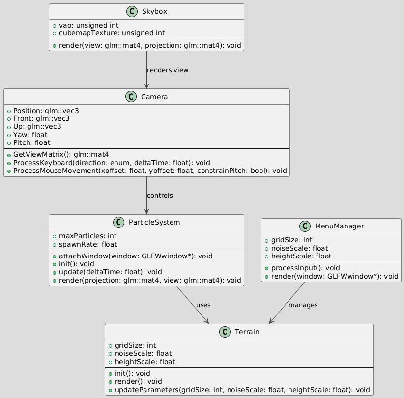

# Terrain Generation and Weather Control System

## Project Overview

**Project Name**: Terrain Generation and Weather Control System  
**Objective**: Implement a procedural terrain generation and real-time weather control system with ambient lighting, particle effects, and user interaction. This project showcases dynamic terrain rendering, weather effects, and camera control in an OpenGL environment.
**Youtube**: https://youtu.be/aAriyz5htzY
---

## Features

### Terrain Generation System
1. **Terrain Mesh Generation**:
   - Generate heightmaps using Perlin Noise.
   - Construct vertex and index buffers based on the heightmap.
   - Compute normals for lighting and shading.

2. **Terrain Rendering and Texturing**:
   - Render terrain using `GL_TRIANGLES`.
   - Apply multiple textures (grass, rock, snow) and blend them based on height for enhanced visual appeal.

3. **Camera Control**:
   - Keyboard controls: Move forward (W), backward (S), left (A), and right (D).
   - Mouse controls: Adjust the camera's view direction.

---

### Weather Control System
1. **Weather Types**:
   - **Sunny**: Default ambient lighting.
   - **Rainy**: Simulated raindrop particle effects.
   - **Snowy**: Simulated snowflake particle effects.

2. **Weather Effects Implementation**:
   - **Particle System**:
     - Use OpenGL to render raindrops and snowflakes.
     - Dynamically update particle positions and states to simulate motion.
   - **Skybox**:
     - Render a dynamic sky using a cubemap.
     - Support transitions between day and night.

---

## Technical Implementation

### Development Environment
- **Programming Language**: C++ (OpenGL 4.x).
- **Libraries and Tools**:
  - GLFW for window management and input handling.
  - GLAD for OpenGL loading.
  - stb_image for texture loading.

### Module Design
1. **Terrain Module**:
   - Generate heightmaps and render dynamic terrain.
2. **Weather Module**:
   - Manage weather states and particle effects.
3. **Rendering Module**:
   - Handle lighting models and shader management.
4. **Interaction Module**:
   - Process user input for camera movement and interaction.

---

## How to Run

1. Install the required dependencies:
   - GLFW
   - GLAD
   - stb_image
2. Compile the project, ensuring all source and header files are correctly linked.
3. Place texture files in the `textures/` directory and shader files in the `shaders/` directory.
4. Run the program and use the following controls:
   - **W/A/S/D**: Move the camera.
   - **Mouse**: Adjust the view direction.
   - **1/2/3**: Switch weather modes (Sunny, Rainy, Snowy).

---

## File Structure

- **src/**: Source files for terrain generation, weather control, rendering, and interaction modules.
- **include/**: Header files including `Camera.h`, `Terrain.h`, and `Skybox.h`.
- **shaders/**: Shader files for vertex and fragment programs.
- **textures/**: Texture images for terrain and skybox.

---

## Implemented Features

- Procedural terrain generation based on heightmaps.
- Particle systems simulating rain and snow.
- Camera movement and view adjustments.
- Dynamic skybox rendering.

---
## UML Diagram

Below is the UML diagram for the system. It visualizes the relationships between different modules:

---
## Resources

- **Material Textures**: High-quality PBR textures for terrain are sourced from [Polyhaven](https://polyhaven.com/).  
- **Skybox Textures**: Space-themed skybox textures are sourced from [OpenGameArt](https://opengameart.org/content/space-skybox-1).

---

## Author

**Name**: Sirun Wu  
**Course**: COMP 3016  
**Year**: 2025
